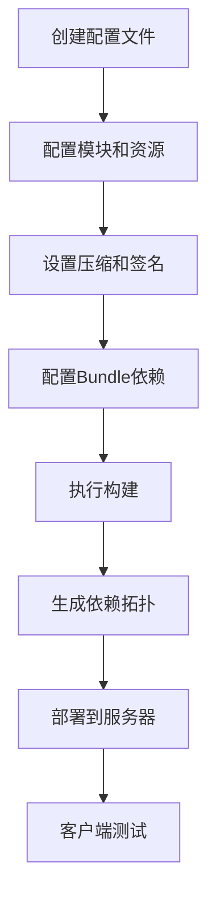
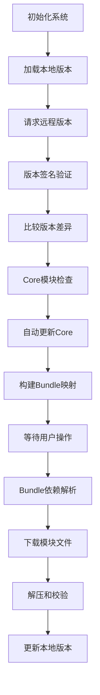
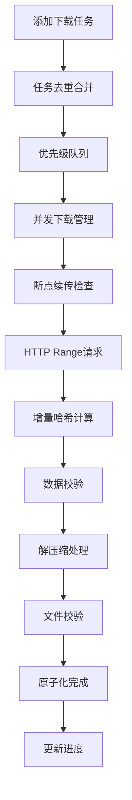

# QHotUpdate System

一个功能完整的Unity热更新系统，支持模块化资源管理、断点续传、多种压缩算法、签名验证、Bundle依赖管理等高级特性。

## 🚀 特性

✅ **模块化设计**：支持按模块管理和更新资源  
✅ **Bundle依赖管理**：自动处理AssetBundle依赖关系  
✅ **多种压缩**：支持ZIP、GZip、LZ4压缩算法  
✅ **断点续传**：网络中断后可恢复下载，支持原子化元数据  
✅ **并发下载**：支持多文件并发下载，智能任务合并  
✅ **优先级队列**：支持下载任务优先级管理和动态调整  
✅ **暂停/恢复/取消**：完整的下载控制功能  
✅ **签名验证**：支持HMAC-SHA256版本签名验证  
✅ **可视化编辑器**：完整的Unity编辑器工具，强制Core模块  
✅ **多平台支持**：Windows、Android、iOS、macOS  
✅ **会话管理**：Bundle级下载会话，支持进度聚合  
✅ **诊断系统**：详细的下载诊断和错误分类

## 📋 目录

- [快速开始](#-快速开始)
- [系统架构](#️-系统架构)
- [编辑器配置](#️-编辑器配置)
- [服务器部署](#-服务器部署)
- [客户端集成](#-客户端集成)
- [Bundle依赖管理](#-bundle依赖管理)
- [路径结构](#-路径结构)
- [工作流程](#-工作流程)
- [API使用](#-api使用)
- [最佳实践](#-最佳实践)
- [常见问题](#-常见问题)

## 🚀 快速开始

### 1. 导入系统
将QHotUpdateSystem文件夹复制到Unity项目的`Assets/Plugins/`目录下。

### 2. 创建配置文件
在Project窗口右键：`Create → QHotUpdate → Config Asset`  
命名为HotUpdateConfig并保存

### 3. 打开编辑器窗口
`Tools → QHotUpdate → HotUpdate Window`

### 4. 基础配置
```csharp
// 在HotUpdateConfig中设置：
baseUrl = "https://your-cdn.com/HotUpdate/"
outputRoot = "HotUpdateOutput"
version = "1.0.0"
hashAlgo = "md5"
enableBundleDependency = true  // 启用Bundle依赖管理
```

### 5. 添加模块
系统会自动创建**Core模块**（强制存在，不可删除），你可以添加其他模块如UI、Audio等。

### 6. 执行构建
点击编辑器窗口的"Build"按钮。

## 🏗️ 系统架构

```
QHotUpdateSystem/
├── Runtime/                    # 运行时系统
│   ├── Core/                  # 核心系统
│   │   ├── HotUpdateContext.cs
│   │   ├── HotUpdateManager.cs
│   │   └── ModuleRuntimeState.cs
│   ├── Download/              # 下载管理
│   │   ├── DownloadManager.cs
│   │   ├── DownloadController.cs
│   │   ├── HttpDownloader.cs
│   │   └── PriorityQueue.cs
│   ├── Version/               # 版本管理
│   │   ├── VersionInfo.cs
│   │   ├── VersionLoader.cs
│   │   └── VersionComparer.cs
│   ├── Compression/           # 压缩系统
│   │   ├── CompressorRegistry.cs
│   │   ├── ZipCompressor.cs
│   │   ├── GZipCompressor.cs
│   │   └── LZ4Compressor.cs
│   ├── Security/              # 安全验证
│   │   ├── HashUtility.cs
│   │   ├── HmacVersionSignatureVerifier.cs
│   │   └── FileNameValidator.cs
│   ├── Platform/              # 平台适配
│   │   ├── IPlatformAdapter.cs
│   │   └── DefaultPlatformAdapter.cs
│   ├── Dependency/            # Bundle依赖管理
│   │   └── BundleDependencyResolver.cs
│   ├── Bundle/                # Bundle便捷接口
│   │   └── HotUpdateAssetBundle.cs
│   └── Events/                # 事件系统
│       ├── HotUpdateEvents.cs
│       ├── BundleDownloadEvents.cs
│       └── MainThreadDispatcher.cs
└── Editor/                    # 编辑器工具
    ├── Windows/               # 编辑器窗口
    │   ├── HotUpdateEditorWindow.cs
    │   └── Sections/
    ├── Builders/              # 构建系统
    │   ├── VersionBuilder.cs
    │   ├── CompressionProcessor.cs
    │   └── HashCalculator.cs
    └── Config/                # 配置管理
        ├── HotUpdateConfigAsset.cs
        └── ModuleConfig.cs
```

## 🛠️ 编辑器配置

### 打开配置窗口
`Tools → QHotUpdate → HotUpdate Window`

### 配置选项卡

#### 1. Config 选项卡
- **输出根目录**：构建输出路径
- **服务器配置**：CDN地址、版本号等
- **签名设置**：HMAC密钥配置
- **压缩设置**：选择压缩算法（None/ZIP/GZip/LZ4）
- **Bundle依赖**：Unity AssetBundle依赖拓扑配置

#### 2. Modules 选项卡
- **左侧面板**：模块列表管理
- **右侧面板**：资源文件配置
- **Core模块**：系统强制模块，位于顶部，不可删除、不可改名、不可移动

#### 3. Preview 选项卡
- 查看构建结果
- 模块文件统计
- Bundle依赖关系展示

#### 4. Logs 选项卡
- 构建日志查看
- 错误信息追踪

### 模块配置
```csharp
public class ModuleConfig
{
    public string moduleName;        // 模块名称
    public bool mandatory;           // 是否必须
    public bool defaultCompress;     // 默认压缩
    public ResourceEntry[] entries;  // 资源条目
    public string[] tags;           // 模块标签
}
```

### 资源条目配置
```csharp
public class ResourceEntry
{
    public string path;              // 文件/目录路径
    public bool includeSubDir;       // 包含子目录
    public string searchPattern;     // 搜索模式 (*.*)
    public bool compress;            // 是否压缩
    public string explicitName;      // 指定输出名
}
```

## 🌐 服务器部署

### 服务器目录结构
```
CDN根目录/
├── Versions/                    # 版本文件目录
│   ├── version_windows.json     # Windows版本文件
│   ├── version_android.json     # Android版本文件
│   └── version_ios.json         # iOS版本文件
└── AssetBundles/               # 资源文件目录
    ├── Windows/                # Windows平台资源
    │   ├── core_bundle.dat
    │   ├── ui_bundle.dat
    │   └── audio_bundle.dat
    ├── Android/                # Android平台资源
    └── iOS/                    # iOS平台资源
```

### 版本文件结构
```json
{
  "version": "1.0.0",
  "timestamp": 1640995200,
  "platform": "Windows",
  "sign": "hmac_signature_here",
  "bundleDeps": [
    {
      "name": "ui_bundle.dat",
      "deps": ["core_bundle.dat"]
    }
  ],
  "modules": [
    {
      "name": "Core",
      "mandatory": true,
      "aggregateHash": "abc123...",
      "sizeBytes": 1048576,
      "compressedSizeBytes": 524288,
      "fileCount": 5,
      "files": [
        {
          "name": "core_bundle.dat",
          "hash": "def456...",
          "size": 512000,
          "compressed": true,
          "cSize": 256000,
          "algo": "gzip"
        }
      ]
    }
  ]
}
```

### 部署步骤
1. **执行构建**：在Unity编辑器中构建版本
2. **上传文件**：将HotUpdateOutput目录内容上传到CDN
3. **配置服务器**：确保支持HTTP Range请求（断点续传）
4. **设置CORS**：如果Web平台需要跨域访问

### 服务器配置示例

#### Nginx配置
```nginx
server {
    listen 80;
    server_name your-cdn.com;
    
    location /HotUpdate/ {
        root /var/www/;
        
        # 支持断点续传
        add_header Accept-Ranges bytes;
        
        # CORS设置
        add_header Access-Control-Allow-Origin *;
        add_header Access-Control-Allow-Methods "GET, HEAD, OPTIONS";
        add_header Access-Control-Allow-Headers "Range";
        
        # 缓存设置
        location ~* \.(json)$ {
            expires 1h;
        }
        
        location ~* \.(dat|bundle)$ {
            expires 1y;
        }
    }
}
```

## 📱 客户端集成

### 1. 初始化系统
```csharp
using QHotUpdateSystem;
using QHotUpdateSystem.Core;
using QHotUpdateSystem.Security;

public async void InitializeHotUpdate()
{
    var manager = HotUpdateManager.Instance;
    
    var options = new HotUpdateInitOptions
    {
        BaseUrl = "https://your-cdn.com/HotUpdate/",
        MaxConcurrent = 4,
        MaxRetry = 3,
        TimeoutSeconds = 30,
        EnableDebugLog = true,
        HashAlgo = "md5"
    };
    
    // 可选：配置签名验证
    var verifier = new HmacVersionSignatureVerifier("your-secret");
    manager.ConfigureSignatureVerifier(verifier, true);
    
    await manager.Initialize(options);
}
```

### 2. 检查更新
```csharp
// 检查模块状态
var coreStatus = manager.GetModuleStatus("Core");
var uiStatus = manager.GetModuleStatus("UI");

// 获取已安装模块
var installedModules = manager.GetInstalledModules();

// 检查Core模块是否就绪
if (!manager.IsCoreReady) {
    await manager.StartCoreUpdate();
}
```

### 3. 执行更新
```csharp
// 更新指定模块
await manager.UpdateModules(new[] { "UI", "Audio" }, DownloadPriority.High);

// 只更新Core模块
await manager.StartCoreUpdate();
```

### 4. 控制下载
```csharp
// 暂停模块下载
manager.PauseModule("UI");

// 恢复模块下载
manager.ResumeModule("UI");

// 取消模块下载
manager.CancelModule("UI");

// 取消所有下载
manager.CancelAll();
```

## 🔗 Bundle依赖管理

### 1. Bundle便捷接口
```csharp
using QHotUpdateSystem;

// 自动下载并加载Bundle（带进度回调）
var progress = new Progress<float>(p => Debug.Log($"进度: {p:P2}"));
var bundle = await HotUpdateAssetBundle.LoadAsync("ui_bundle", true, DownloadPriority.High, progress);

// 简单加载（无进度回调）
var bundle2 = await HotUpdateAssetBundle.LoadAsync("audio_bundle");
```

### 2. 会话管理
```csharp
// 确保Bundle及其依赖已下载（返回会话ID）
var sessionId = await manager.EnsureBundlesDownloadedSessionAsync(
    new[] { "ui_bundle", "game_bundle" }, 
    DownloadPriority.High
);

if (sessionId.HasValue) {
    Debug.Log($"下载会话: {sessionId.Value}");
}
```

### 3. Bundle事件订阅
```csharp
using QHotUpdateSystem.BundleEvents;

// 订阅Bundle下载事件
BundleDownloadEvents.OnStart += (info) => {
    Debug.Log($"Bundle会话开始: {info.SessionId}");
    Debug.Log($"根Bundle: {string.Join(", ", info.RootBundles)}");
    Debug.Log($"闭包Bundle: {string.Join(", ", info.ClosureBundles)}");
};

BundleDownloadEvents.OnProgress += (info) => {
    Debug.Log($"Bundle进度: {info.Progress:P2}");
};

BundleDownloadEvents.OnCompleted += (info) => {
    Debug.Log($"Bundle下载完成: {info.SessionId}");
};
```

## 📂 路径结构

### 客户端本地路径
```
Application.persistentDataPath/
└── HotUpdate/                   # 热更新根目录
    ├── version_windows.json     # 本地版本文件
    ├── AssetBundles/           # 资源文件目录
    │   ├── Windows/            # 平台特定目录
    │   │   ├── core_bundle.dat
    │   │   ├── ui_bundle.dat
    │   │   └── audio_bundle.dat
    └── temp/                   # 临时下载目录
        ├── Windows/            # 平台特定临时目录
        │   ├── a1b2c3d4_e5f6g7h8_hash123.part     # 新命名格式
        │   ├── a1b2c3d4_e5f6g7h8_hash123.part.meta # 断点续传元数据
        │   └── ...
```

### 平台适配器路径
```csharp
public interface IPlatformAdapter
{
    string GetPlatformName();                    // "Windows", "Android", "iOS"
    string GetRemoteVersionFileUrl(string baseUrl); // 远程版本文件URL
    string GetRemoteAssetFileUrl(string baseUrl, string fileName); // 远程资源文件URL
    string GetPersistentRoot();                  // 本地持久化根目录
    string GetLocalVersionFilePath();           // 本地版本文件路径
    string GetLocalAssetDir();                  // 本地资源目录
    string GetTempDir();                        // 临时文件目录
}
```

## 🔄 工作流程

### 开发阶段


### 运行时流程


### 下载流程


## 📖 API使用

### 事件订阅
```csharp
using QHotUpdateSystem.EventsSystem;
using QHotUpdateSystem.Events;
using QHotUpdateSystem.Download;

// 订阅进度事件
HotUpdateEvents.OnGlobalProgress += (info) => {
    Debug.Log($"总进度: {info.Progress:P2}");
    progressSlider.value = info.Progress;
};

// 订阅模块状态变化
HotUpdateEvents.OnModuleStatusChanged += (module, status) => {
    Debug.Log($"模块 {module} 状态: {status}");
};

// 订阅文件级错误事件（新增）
HotUpdateEvents.OnFileError += (module, file, errorCode, message) => {
    Debug.LogError($"文件错误 - 模块:{module} 文件:{file} 错误码:{errorCode} 消息:{message}");
};

// 订阅诊断事件（新增）
HotUpdateEvents.OnDiagnostics += (snapshot) => {
    Debug.Log($"诊断 - 队列:{snapshot.QueuedCount} 运行:{snapshot.RunningCount} 完成:{snapshot.CompletedCount}");
};
```

### 高级控制
```csharp
// 获取下载状态
var downloadState = manager.DownloadState;

// 检查Core模块状态
if (!manager.IsCoreReady) {
    await manager.StartCoreUpdate();
}

// 按优先级更新
await manager.UpdateModules(criticalModules, DownloadPriority.Critical);
await manager.UpdateModules(normalModules, DownloadPriority.Normal);

// 检查Bundle是否就绪
if (manager.IsBundleReady("ui_bundle")) {
    var bundle = await manager.LoadBundleAsync("ui_bundle");
}
```

### 完整示例
```csharp
using System;
using System.Collections.Generic;
using UnityEngine;
using QHotUpdateSystem;
using QHotUpdateSystem.Core;
using QHotUpdateSystem.EventsSystem;
using QHotUpdateSystem.Events;
using QHotUpdateSystem.Security;

public class HotUpdateExample : MonoBehaviour
{
    [Header("配置")]
    public string baseUrl = "https://your-cdn.com/HotUpdate/";
    public string hmacSecret = "your-secret-key";
    public bool enableSignatureVerify = true;

    [Header("UI引用")]
    public UnityEngine.UI.Button checkUpdateButton;
    public UnityEngine.UI.Button startUpdateButton;
    public UnityEngine.UI.Slider progressSlider;
    public UnityEngine.UI.Text statusText;

    private HotUpdateManager _hotUpdateManager;
    private List<string> _pendingModules = new List<string>();

    async void Start()
    {
        await InitializeHotUpdateSystem();
        SetupUI();
        SubscribeToEvents();
        CheckCoreModuleStatus();
    }

    private async System.Threading.Tasks.Task InitializeHotUpdateSystem()
    {
        try
        {
            _hotUpdateManager = HotUpdateManager.Instance;

            var options = new HotUpdateInitOptions
            {
                BaseUrl = baseUrl,
                MaxConcurrent = 4,
                MaxRetry = 3,
                TimeoutSeconds = 30,
                EnableDebugLog = true,
                HashAlgo = "md5"
            };

            if (enableSignatureVerify && !string.IsNullOrEmpty(hmacSecret))
            {
                var verifier = new HmacVersionSignatureVerifier(hmacSecret);
                _hotUpdateManager.ConfigureSignatureVerifier(verifier, true);
            }

            await _hotUpdateManager.Initialize(options);
            UpdateStatusText("热更新系统初始化完成");
        }
        catch (Exception ex)
        {
            UpdateStatusText($"初始化失败: {ex.Message}");
        }
    }

    private void SubscribeToEvents()
    {
        HotUpdateEvents.OnGlobalProgress += OnGlobalProgress;
        HotUpdateEvents.OnModuleStatusChanged += OnModuleStatusChanged;
        HotUpdateEvents.OnError += OnError;
        HotUpdateEvents.OnFileError += OnFileError;
        HotUpdateEvents.OnCoreReady += OnCoreReady;
    }

    private void OnGlobalProgress(GlobalProgressInfo info)
    {
        if (progressSlider)
            progressSlider.value = info.Progress;
        UpdateStatusText($"总进度: {info.Progress:P2} ({info.DownloadedBytes}/{info.TotalBytes})");
    }

    private void OnModuleStatusChanged(string module, ModuleStatus status)
    {
        Debug.Log($"模块 {module} 状态变更: {status}");
    }

    private void OnError(string module, string message)
    {
        Debug.LogError($"模块 {module} 错误: {message}");
    }

    private void OnFileError(string module, string file, DownloadErrorCode errorCode, string message)
    {
        Debug.LogError($"文件错误 - 模块:{module} 文件:{file} 错误码:{errorCode}");
    }

    private void OnCoreReady()
    {
        UpdateStatusText("Core模块已就绪，可以使用应用程序");
    }

    private void UpdateStatusText(string text)
    {
        if (statusText)
            statusText.text = text;
        Debug.Log($"[HotUpdate] {text}");
    }

    // 其他方法...
}
```

## 🎯 最佳实践

### 1. 模块划分建议
- **Core**：核心游戏逻辑，必须模块，系统强制存在
- **UI**：界面资源，高优先级
- **Audio**：音频资源，中优先级
- **Localization**：本地化文件，低优先级
- **Optional**：可选内容，按需下载

### 2. 版本号管理
```
主版本.次版本.修订版本
1.0.0 -> 1.0.1 -> 1.1.0 -> 2.0.0
```

### 3. 压缩策略
- **文本文件**：使用GZip压缩
- **二进制文件**：使用LZ4快速压缩
- **小文件**：不压缩，避免负优化
- **AssetBundle**：根据内容类型选择合适算法

### 4. Bundle依赖优化
```csharp
// 合理规划Bundle依赖层次
Core Bundle (基础资源)
├── UI Bundle (界面资源)
├── Audio Bundle (音频资源)  
└── Game Bundle (游戏逻辑)
    ├── Level1 Bundle
    ├── Level2 Bundle
    └── ...
```

### 5. 安全建议
- 启用版本签名验证
- 使用HTTPS传输
- 定期更换HMAC密钥
- 文件名安全校验

### 6. 性能优化
```csharp
// 根据网络状况调整并发数
var options = new HotUpdateInitOptions
{
    MaxConcurrent = Application.internetReachability == NetworkReachability.ReachableViaCarrierDataNetwork ? 2 : 4
};

// 使用Bundle便捷接口
var bundle = await HotUpdateAssetBundle.LoadAsync("ui_bundle", true, DownloadPriority.High);
```

### 7. 错误处理
```csharp
// 订阅详细错误事件
HotUpdateEvents.OnFileError += (module, file, errorCode, message) => {
    switch (errorCode) {
        case DownloadErrorCode.Network:
            // 网络错误处理
            break;
        case DownloadErrorCode.IntegrityMismatch:
            // 完整性校验失败处理
            break;
        case DownloadErrorCode.DecompressFail:
            // 解压失败处理
            break;
    }
};
```

## ❓ 常见问题

### Q: 如何处理网络异常？
**A**: 系统内置重试机制，支持断点续传，网络恢复后自动继续下载。新版本支持更精确的错误分类和诊断。

### Q: 如何实现增量更新？
**A**: 系统自动比较文件Hash，只下载变更的文件。支持模块级和文件级的精确更新。

### Q: Bundle依赖如何管理？
**A**: 系统自动读取Unity的AssetBundleManifest，生成依赖拓扑图，运行时自动解析依赖闭包。

### Q: 如何支持热重载代码？
**A**: 这个系统主要用于资源热更新，代码热重载需要结合其他方案如ILRuntime或HybridCLR。

### Q: 下载失败怎么办？
**A**: 检查网络连接、服务器状态、文件权限。新版本提供详细的错误码和诊断信息。

### Q: 如何自定义平台适配？
**A**: 实现`IPlatformAdapter`接口，在初始化时传入自定义适配器。

### Q: 支持哪些压缩格式？
**A**: 目前支持ZIP、GZip、LZ4三种压缩算法，可以按模块和文件分别配置。

### Q: Core模块有什么特殊性？
**A**: Core模块是系统强制模块，位于模块列表顶部，不可删除、不可改名、不可移动，系统启动时会自动检查和更新。

### Q: 如何使用Bundle便捷接口？
**A**: 使用`HotUpdateAssetBundle.LoadAsync()`可以自动处理依赖下载和Bundle加载，支持进度回调。

### Q: 断点续传如何工作？
**A**: 系统使用`.part`文件和`.meta`元数据文件实现断点续传，支持ETag和Last-Modified验证，确保续传的可靠性。

## 📄 许可证

本项目采用MIT许可证，详见LICENSE文件。

## 🤝 贡献

欢迎提交Issue和Pull Request！

## 🎮 让热更新变得简单！

此系统由**小梦**开发(大多用AI工具)

**联系方式**: QQ-2649933509 | BiLiBiLi- 小梦丶StarryDream

---

> **重要提示**: 本系统专注于资源热更新，不包含代码热更新功能。如需代码热更新，请结合ILRuntime、HybridCLR等方案使用。