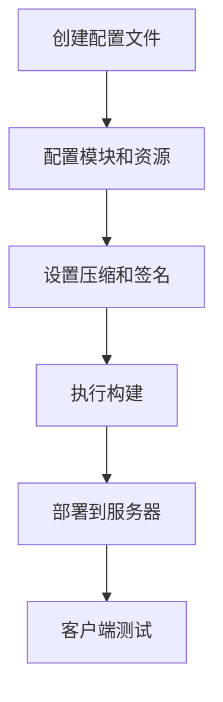
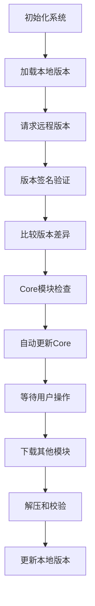
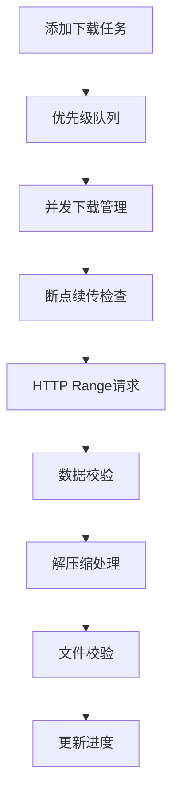

# QHotUpdate System

一个功能完整的Unity热更新系统，支持模块化资源管理、断点续传、多种压缩算法、签名验证等高级特性。
# 注意:在热更新代码中初始化时需要调用: AssetBundleSettings.LoadAssetResFromStreamingAssetsPath = false; 确保设置QFramework为持久化热更路径模式
## 🚀 特性

- ✅ **模块化设计**：支持按模块管理和更新资源
- ✅ **多种压缩**：支持ZIP、GZip、LZ4压缩算法
- ✅ **断点续传**：网络中断后可恢复下载
- ✅ **并发下载**：支持多文件并发下载
- ✅ **优先级队列**：支持下载任务优先级管理
- ✅ **暂停/恢复/取消**：完整的下载控制功能
- ✅ **签名验证**：支持HMAC-SHA256版本签名验证
- ✅ **可视化编辑器**：完整的Unity编辑器工具
- ✅ **多平台支持**：Windows、Android、iOS、macOS

## 📋 目录

- [快速开始](#快速开始)
- [系统架构](#系统架构)
- [编辑器配置](#编辑器配置)
- [服务器部署](#服务器部署)
- [客户端集成](#客户端集成)
- [路径结构](#路径结构)
- [工作流程](#工作流程)
- [API使用](#api使用)
- [最佳实践](#最佳实践)
- [常见问题](#常见问题)

## 🚀 快速开始

### 1. 导入系统

将QHotUpdateSystem文件夹复制到Unity项目的`Assets/Plugins/`目录下。

### 2. 创建配置文件

1. 在Project窗口右键：`Create → QHotUpdate → Config Asset`
2. 命名为`HotUpdateConfig`并保存

### 3. 打开编辑器窗口

`Tools → QHotUpdate → HotUpdate Window`

### 4. 基础配置

```csharp
// 在HotUpdateConfig中设置：
baseUrl = "https://your-cdn.com/HotUpdate/"
outputRoot = "HotUpdateOutput"
version = "1.0.0"
hashAlgo = "md5"
```

### 5. 添加模块

系统会自动创建Core模块，你可以添加其他模块如UI、Audio等。

### 6. 执行构建

点击编辑器窗口的"Build"按钮。

## 🏗️ 系统架构

```
QHotUpdateSystem/
├── Runtime/                    # 运行时系统
│   ├── Core/                  # 核心系统
│   ├── Download/              # 下载管理
│   ├── Version/               # 版本管理
│   ├── Compression/           # 压缩系统
│   ├── Security/              # 安全验证
│   └── Platform/              # 平台适配
└── Editor/                    # 编辑器工具
  ├── Windows/               # 编辑器窗口
  ├── Builders/              # 构建系统
  └── Config/                # 配置管理
```

## 🛠️ 编辑器配置

### 打开配置窗口
```
Tools → QHotUpdate → HotUpdate Window
```

### 配置选项卡

#### 1. Config 选项卡
- **输出根目录**：构建输出路径
- **服务器配置**：CDN地址、版本号等
- **签名设置**：HMAC密钥配置

#### 2. Modules 选项卡
- **左侧面板**：模块列表管理
- **右侧面板**：资源文件配置
- **Core模块**：系统强制模块，不可删除

#### 3. Preview 选项卡
- 查看构建结果
- 模块文件统计

#### 4. Logs 选项卡
- 构建日志查看

### 模块配置

```csharp
// 每个模块包含：
public class ModuleConfig
{
  public string moduleName;        // 模块名称
  public bool mandatory;           // 是否必须
  public bool defaultCompress;     // 默认压缩
  public ResourceEntry[] entries;  // 资源条目
  public string[] tags;           // 模块标签
}
```

### 资源条目配置

```csharp
public class ResourceEntry
{
  public string path;              // 文件/目录路径
  public bool includeSubDir;       // 包含子目录
  public string searchPattern;     // 搜索模式 (*.*)
  public bool compress;            // 是否压缩
  public string explicitName;      // 指定输出名
}
```

## 🌐 服务器部署

### 服务器目录结构

```
CDN根目录/
├── Versions/                    # 版本文件目录
│   ├── version_windows.json     # Windows版本文件
│   ├── version_android.json     # Android版本文件
│   └── version_ios.json         # iOS版本文件
└── AssetBundles/               # 资源文件目录
  ├── Windows/                # Windows平台资源
  │   ├── core_bundle.dat
  │   ├── ui_bundle.dat
  │   └── audio_bundle.dat
  ├── Android/                # Android平台资源
  └── iOS/                    # iOS平台资源
```

### 版本文件结构

```json
{
"version": "1.0.0",
"timestamp": 1640995200,
"platform": "Windows",
"sign": "hmac_signature_here",
"modules": [
  {
    "name": "Core",
    "mandatory": true,
    "aggregateHash": "abc123...",
    "sizeBytes": 1048576,
    "compressedSizeBytes": 524288,
    "fileCount": 5,
    "files": [
      {
        "name": "core_bundle.dat",
        "hash": "def456...",
        "size": 512000,
        "compressed": true,
        "cSize": 256000,
        "algo": "gzip"
      }
    ]
  }
]
}
```

### 部署步骤

1. **执行构建**：在Unity编辑器中构建版本
2. **上传文件**：将`HotUpdateOutput`目录内容上传到CDN
3. **配置服务器**：确保支持HTTP Range请求（断点续传）
4. **设置CORS**：如果Web平台需要跨域访问

### 服务器配置示例

#### Nginx配置
```nginx
server {
  listen 80;
  server_name your-cdn.com;
  
  location /HotUpdate/ {
      root /var/www/;
      
      # 支持断点续传
      add_header Accept-Ranges bytes;
      
      # CORS设置
      add_header Access-Control-Allow-Origin *;
      add_header Access-Control-Allow-Methods "GET, OPTIONS";
      add_header Access-Control-Allow-Headers "Range";
      
      # 缓存设置
      location ~* \.(json)$ {
          expires 1h;
      }
      
      location ~* \.(dat|bundle)$ {
          expires 1y;
      }
  }
}
```

## 📱 客户端集成

### 1. 初始化系统

```csharp
using QHotUpdateSystem;
using QHotUpdateSystem.Core;

public async void InitializeHotUpdate()
{
  var manager = HotUpdateManager.Instance;
  
  var options = new HotUpdateInitOptions
  {
      BaseUrl = "https://your-cdn.com/HotUpdate/",
      MaxConcurrent = 4,
      MaxRetry = 3,
      TimeoutSeconds = 30,
      EnableDebugLog = true,
      HashAlgo = "md5"
  };
  
  // 可选：配置签名验证
  var verifier = new HmacVersionSignatureVerifier("your-secret");
  manager.ConfigureSignatureVerifier(verifier, true);
  
  await manager.Initialize(options);
}
```

### 2. 检查更新

```csharp
// 检查模块状态
var coreStatus = manager.GetModuleStatus("Core");
var uiStatus = manager.GetModuleStatus("UI");

// 获取已安装模块
var installedModules = manager.GetInstalledModules();
```

### 3. 执行更新

```csharp
// 更新指定模块
await manager.UpdateModules(new[] { "UI", "Audio" }, DownloadPriority.High);

// 只更新Core模块
await manager.StartCoreUpdate();
```

### 4. 控制下载

```csharp
// 暂停模块下载
manager.PauseModule("UI");

// 恢复模块下载
manager.ResumeModule("UI");

// 取消模块下载
manager.CancelModule("UI");

// 取消所有下载
manager.CancelAll();
```

## 📂 路径结构

### 客户端本地路径

```
Application.persistentDataPath/
└── HotUpdate/                   # 热更新根目录
  ├── version_windows.json     # 本地版本文件
  ├── AssetBundles/           # 资源文件目录
  │   ├── core_bundle.dat
  │   ├── ui_bundle.dat
  │   └── audio_bundle.dat
  └── temp/                   # 临时下载目录
      ├── ui_bundle.dat.part  # 下载中的文件
      └── audio_bundle.dat.part
```

### 平台适配器路径

```csharp
public interface IPlatformAdapter
{
  string GetPlatformName();                    // "Windows", "Android", "iOS"
  string GetRemoteVersionFileUrl(string baseUrl); // 远程版本文件URL
  string GetRemoteAssetFileUrl(string baseUrl, string fileName); // 远程资源文件URL
  string GetPersistentRoot();                  // 本地持久化根目录
  string GetLocalVersionFilePath();           // 本地版本文件路径
  string GetLocalAssetDir();                  // 本地资源目录
  string GetTempDir();                        // 临时文件目录
}
```

## 🔄 工作流程

### 开发阶段



### 运行时流程



### 下载流程



## 📖 API使用

### 事件订阅

```csharp
using QHotUpdateSystem.EventsSystem;
using QHotUpdateSystem.Events;

// 订阅进度事件
HotUpdateEvents.OnGlobalProgress += (info) => {
  Debug.Log($"总进度: {info.Progress:P2}");
  progressSlider.value = info.Progress;
};

// 订阅模块状态变化
HotUpdateEvents.OnModuleStatusChanged += (module, status) => {
  Debug.Log($"模块 {module} 状态: {status}");
};

// 订阅错误事件
HotUpdateEvents.OnError += (module, error) => {
  Debug.LogError($"模块 {module} 错误: {error}");
};
```

### 高级控制

```csharp
// 获取下载状态
var downloadState = manager.DownloadState;

// 检查Core模块状态
if (!manager.IsCoreReady) {
  await manager.StartCoreUpdate();
}

// 按优先级更新
await manager.UpdateModules(criticalModules, DownloadPriority.Critical);
await manager.UpdateModules(normalModules, DownloadPriority.Normal);
```

## 🎯 最佳实践

### 1. 模块划分建议

- **Core**：核心游戏逻辑，必须模块
- **UI**：界面资源，高优先级
- **Audio**：音频资源，中优先级  
- **Localization**：本地化文件，低优先级
- **Optional**：可选内容，按需下载

### 2. 版本号管理

```
主版本.次版本.修订版本
1.0.0 -> 1.0.1 -> 1.1.0 -> 2.0.0
```

### 3. 压缩策略

- **文本文件**：使用GZip压缩
- **二进制文件**：使用LZ4快速压缩
- **小文件**：不压缩，避免负优化

### 4. 安全建议

- 启用版本签名验证
- 使用HTTPS传输
- 定期更换HMAC密钥

### 5. 性能优化

```csharp
// 根据网络状况调整并发数
var options = new HotUpdateInitOptions
{
  MaxConcurrent = Application.internetReachability == NetworkReachability.ReachableViaCarrierDataNetwork ? 2 : 4
};
```

## ❓ 常见问题

### Q: 如何处理网络异常？
A: 系统内置重试机制，支持断点续传，网络恢复后自动继续下载。

### Q: 如何实现增量更新？
A: 系统自动比较文件Hash，只下载变更的文件。

### Q: 如何支持热重载代码？
A: 这个系统主要用于资源热更新，代码热重载需要结合其他方案如ILRuntime或HybridCLR。

### Q: 下载失败怎么办？
A: 检查网络连接、服务器状态、文件权限，查看日志获取详细错误信息。

### Q: 如何自定义平台适配？
A: 实现`IPlatformAdapter`接口，在初始化时传入自定义适配器。

### Q: 支持哪些压缩格式？
A: 目前支持ZIP、GZip、LZ4三种压缩算法。

## 📄 许可证

本项目采用MIT许可证，详见LICENSE文件。

## 🤝 贡献

欢迎提交Issue和Pull Request！

---

**🎮 让热更新变得简单！**

此系统由-小梦开发(大多用AI工具)

联系方式:
QQ-2649933509
BiLiBiLi- 小梦丶StarryDream
